# Groundnut

**Groundnut is the canonical evidence and claim-checking engine for AI systems
that must show their work.**

It takes claims, questions, sources, and a frozen checking policy. It returns a
replayable account of what the evidence supports, contradicts, leaves
incomplete, or cannot assess.

Groundnut does not decide that a claim is true because a quotation exists.
Presence, relevance, support, authority, completeness, and truth are different
questions. The engine keeps them separate.

## North star

Groundnut is the reusable control plane between model-generated work and
consequential use.

```text
claims + evidence universe + frozen policy
                    |
                    v
       canonical, source-bound decisions
                    |
                    v
 support | contradiction | insufficiency | access failure | unassessed
                    |
                    v
       hashes | offsets | provenance | replay | explicit uncertainty
```

The goal is not one perfect model. Groundnut is built to combine deterministic
checks, navigation, relevance, entailment, contradiction, and adversarial
review behind one frozen policy. Today the canonical path runs the
deterministic checks and one admitted signal; the composition stage exists only
as an exploratory shadow receipt. Each part stays labelled, pinned, measured,
replayable, and removable.

Products supply domain policy, credentials, audience, and presentation. They
must not rebuild the checking engine.

## Where it stands, in plain English

Groundnut has a fail-closed control system that has not yet been exercised
against an adversary, and an unfinished semantic judge.

- The engine can ingest reports, preserve citations, snapshot sources, anchor
  excerpts, record provenance, run component signals, abstain safely, and
  reproduce its decisions.
- The original contract extractor remains as a compatibility pipeline. Its
  published gate still fails. Groundnut does not hide or reinterpret that
  result.
- The canonical semantic-support gate is **NOT MEASURED**. The required
  human-adjudicated benchmark is not complete. Groundnut makes no production
  quality claim for semantic support.
- Seven learned approaches have been explored. None is admitted as the final
  judge. AlignScore is the strongest complete-label candidate. Extractive QA is
  the strongest independent relevance candidate.
- Structured navigation has a strict, hash-bound experimental interface. Short
  handles increased exact evidence coverage from 3/100 to 13/100 with Qwen3
  0.6B. That model is still rejected, because 13% recall is unsafe. Navigation
  is not yet a stage of the canonical run.
- The first private IC report exercised the controls end to end. The composer
  held every claim rather than assert one: 63 withheld, 32 needing validation,
  10 with unavailable sources, and no verification questions present. That is
  the fail-closed path at work, not a measurement of semantic accuracy.

- The claim ledger (`docs/LEDGER.md`) puts every prose unit of a report in one
  of three buckets: cited and verified, cited but drifted, own reasoning. On
  the first real report: 401 units, 63 / 42 / 296. That is the product shape;
  the semantic judge slots into the middle bucket when one is admitted.

The immediate job is to measure the semantic-support layer properly. The next
navigation job is a test of a stronger selector against the same frozen 100-case
pack, without a change to the interface.

## Engine shape

```mermaid
flowchart LR
    A["Source reference or file"] --> B["Resolve and snapshot"]
    B --> C["Navigate frozen source structure"]
    C --> D["Segment and extract claims"]
    D --> E["Exact, numeric and attribution checks"]
    E --> F["Relevance, support and contradiction signals"]
    F --> G["Groundnut decision and abstention policy"]
    G --> H["Frozen-policy arena"]
    H --> I["Source-bound report, manifest and gate"]
```



Groundnut owns:

- acquisition, snapshots, navigation, segmentation, and exact source anchors
- mechanical checks and separate relevance, support, contradiction, and
  authority signals
- versioned domain packs, analytical provenance, and calculation lineage
- frozen decision, abstention, and adversarial-review policies
- render-parity checks that detect evidence disappearing from delivered
  reports when run (`python3 -m groundnut.render_cli`; not yet part of a
  canonical run)
- one replayable manifest for sources, policies, components, and outputs

Groundnut does not own deployment identity, credentials, publication authority,
or final human sign-off. It can grow a review interface or storage layer when
that directly improves checking quality. The boundary is authority, not code
size. Read [ARCHITECTURE.md](./ARCHITECTURE.md).

## Rules that do not move

- **Evidence before confidence.** A high score cannot repair missing evidence.
- **Fail closed.** Missing sources, missing checks, invalid model output, and
  judge disagreement stay visible.
- **Replay everything.** Every material input, policy, component, decision, and
  output has an identity and a hash.
- **Earn every quality claim.** A portable configuration does not inherit
  another domain's score.
- **Freeze before scoring.** Cases, policies, thresholds, metrics, and stopping
  rules are fixed before an admission run.
- **No network in deterministic tests.** Live acquisition is explicit. The
  engine snapshots its successful output.
- **Publish numbers, not protected data.** Corpora and private report rows stay
  outside this repository.

## Measured, replaceable components

Groundnut adopts useful mechanisms, not donor product claims. External
components produce typed signals. Groundnut preserves their raw outputs and
owns the final decision.

Groundnut has explored TreeDex, PageIndex, AlignScore, MiniCheck,
LettuceDetect, SummaC, BGE rerankers, extractive QA, semchunk, OpenContracts,
and Inspect AI. No learned component is admitted as the semantic judge.
Selectable-only navigation handles are retained as infrastructure. The tested
Qwen3 0.6B selector is rejected.

The measurements and donor decisions live in
[EXPERIMENTS.md](./docs/EXPERIMENTS.md),
[SUPPORT-EXPLORATION.md](./docs/SUPPORT-EXPLORATION.md), and
[NAVIGATION.md](./docs/NAVIGATION.md). Public aggregate receipts live in
`results/`.

## Three separate gates

Groundnut does not swap a metric after it sees a result:

1. **Compatibility extraction gate.** This is the original 41-category CUAD
   extractor gate. It carries four bars. Its best recorded run fails macro-F1
   and high-severity precision, passes quote grounding, and has no published
   perturbation-probe gap. An unpublished bar scores as unmet, not as passed.
2. **Canonical semantic-support gate.** Current state: **NOT MEASURED**. It can
   change only after a preregistered run on accepted, human-reviewed cases.
3. **Domain qualification gates.** Each exact domain pack needs its own labelled
   development set and protected holdout. Configuration portability is not
   evidence of quality.

The exact bars, results, and grounding caveats stay public in
[GATES.md](./GATES.md) and [FINDINGS.md](./docs/FINDINGS.md).

## Interfaces

`groundnut.canonical_cli` is the stable JSON boundary for Python, TypeScript,
and other hosts. Its request and response schemas are
`groundnut-canonical-request/v1` and `groundnut-canonical-response/v1`.
Replay-only acquisition is the default. Live acquisition is explicit, and the
engine archives a successful live result before replay. Only the frozen
exact-support baseline is admitted while the support gate is unmeasured.

Module CLIs cover the canonical check, the support admission gate, arena
adjudication, and render parity. Support review, annotation import, and
navigation experiments are `scripts/` with their own argument surfaces; they are
documented in `docs/SUPPORT.md`, `docs/ANNOTATION.md`, and `docs/NAVIGATION.md`
but have no contract CLI yet.

Which support detectors the canonical path will execute is decided by
`groundnut/admitted_detectors.py`. Only the exact baseline is admitted; the
canonical path therefore cannot emit `contradicted` until the support gate is
measured and a detector passes it.

The deterministic test suite is offline and needs Python 3.12 and `pytest`.

The CUAD corpus and gold answers are not in this repository.
`scripts/fetch_corpus.py` rebuilds the corpus from its manifest. The protected
holdout stays unspent until a preregistered development gate passes.

## Repository guide

| Path | Purpose |
|---|---|
| `groundnut/` | Canonical engine, contracts, policies, provenance, and CLIs |
| `domains/` | Versioned domain packs and evidence-maturity disclosures |
| `policies/` | Frozen support and arena policies |
| `pipeline/`, `harness/` | Compatibility extractor and historical gate |
| `tests/` | Offline deterministic conformance suite |
| `results/` | Public aggregate experiment results, never private source rows |
| `docs/` | Contracts, experiments, and measurement records |
| `docs/history/` | Superseded extraction-project documents, kept for provenance |
| [ARCHITECTURE.md](./ARCHITECTURE.md) | Scope, authority boundary, and invariants |
| [GATES.md](./GATES.md) | Compatibility, semantic-support, and domain gate roles |

Inside `docs/`: [EXPERIMENTS.md](./docs/EXPERIMENTS.md) holds experiment order,
transplant rules, and decisions. [SUPPORT.md](./docs/SUPPORT.md) holds the
semantic-support contracts and the admission protocol.
[NAVIGATION.md](./docs/NAVIGATION.md) holds the navigation contracts and the
N1-N3 results. [ANNOTATION.md](./docs/ANNOTATION.md) holds the LegalBench-RAG
and OpenContracts review workflow.
[ANALYTICAL-PROVENANCE.md](./docs/ANALYTICAL-PROVENANCE.md) holds the evidence,
assertion, calculation, inference, and recommendation types.

## Downstream use

IC research is the first private proving ground. It does not set Groundnut's
architecture and it is not a production cutover. Atlas, other product v2s, and
operating-system ports are possible later consumers.

Hosts can integrate through the canonical JSON boundary and domain profiles.
They keep private company data, credentials, audience rules, and publication
decisions outside this public repository.

## Licence and attribution

Groundnut code is Apache 2.0. Read [LICENSE](./LICENSE).

No explored component is admitted, so no component licence currently
propagates. Each component carries its own terms and some are not Apache 2.0.
The leading relevance challenger is CC BY 4.0. Licences are recorded per
component in the `results/` receipts and must be cleared before admission.

The compatibility corpus is CUAD v1, copyright The Atticus Project, licensed
under CC BY 4.0. Groundnut does not redistribute the contract text.

> Hendrycks, Burns, Chen and Ball. *CUAD: An Expert-Annotated NLP Dataset for
> Legal Contract Review.* NeurIPS 2021.
