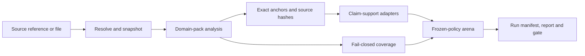

# Groundnut 🥜

Sources and a checking policy in; evidence-linked findings and an honest account
of what could not be established out.

Groundnut is a canonical anti-hallucination and checking engine. It combines
document acquisition, source snapshots, checklist-driven analysis, exact
provenance, claim verification, fail-closed coverage, adversarial review, and
reproducible evaluation behind portable contracts.

It is deliberately domain-configurable. Change the domain pack and the same
method can review contracts, procurement files, trust instruments, research
claims, or another evidence-backed document set:

- **Canonical engine** — `groundnut/`. Domain packs, exact source anchors,
  fail-closed coverage, source snapshots, and the adversarial arena.
- **Domain packs** — `domains/`. Versioned checklists with explicit evidence
  maturity; configuration portability never implies measured quality.
- **Compatibility pipeline** — `pipeline/`. The original contract-extraction
  CLI and backend adapters.
- **Evaluation kernel** — `harness/`. Deterministic scoring and gates; no LLM
  on the pass/fail path.

The name is the job, but *grounded* has several layers. Groundnut keeps them
separate: whether a source was retrieved, whether an excerpt occurs in it,
whether that evidence supports the claim, whether every required check ran,
and whether an adversarial review passed. Success at one layer never silently
becomes success at the next.

## The engine



Groundnut owns the portable method and the artifacts passed between these
stages:

- **Acquisition and snapshots** — local and explicit HTTP resolution, honest
  inaccessible/paywalled/unsupported states, normalized bytes, and tamper-
  detecting hashes. Analysis never fetches implicitly.
- **Domain packs** — versioned prompts, category and document-type taxonomies,
  severities, playbook hashes, and evidence maturity. A configuration can ship
  experimentally without borrowing another domain's score.
- **Anchored analysis** — extracted findings retain source hashes, exact
  character offsets, category identity, and severity.
- **Claim verification** — citation accessibility and excerpt presence are
  measured independently. Numeric-preserving fuzzy matching may locate an
  excerpt, but an anchored quote still reports `support: not_assessed` until a
  separate support checker evaluates it.
- **Batch checking** — `check_claims` composes resolution, mechanical
  verification, and one frozen support policy into a deterministic report. Its
  completeness and metrics are derived from the claim rows, not supplied by a
  caller, and the report can be bound directly into the run manifest.
- **Coverage** — no finding is not the same as a clear check. `checked_clear`
  requires every source segment to complete and acknowledge the category;
  otherwise the result is `incomplete`.
- **Adversarial arena** — attacks and rulings are evaluated under a frozen
  policy. Missing attacks, missing rulings, and judge disagreement remain
  `unattacked`, `unruled`, or `withheld`; none is converted into exoneration.
- **Evaluation contracts** — development and holdout evidence, deterministic
  gates, replayable model outputs, and explicit comparator semantics prevent a
  passing number from being manufactured after the run.
- **Run provenance** — one order-stable manifest binds the engine revision,
  domain playbook and evidence manifest, normalized sources and snapshots,
  frozen policies, runtime component configurations, and output artifacts.

### What it does not claim

Groundnut is not a truth oracle. A readable source can be wrong; a verbatim
quote can be irrelevant; a detector can miss a contradiction; and an
experimental domain pack can be portable without being accurate. Reports keep
those uncertainties visible instead of compressing them into one confidence
score.

Groundnut is not constrained to a small library. It may grow first-party corpus,
annotation, adjudication, persistence, and operator surfaces when they make the
checking system materially more reliable. Deployment identity, credential
custody, publication authority, and final human sign-off remain explicit
boundaries rather than conclusions the checker can manufacture.

## Measured components, optional detectors

Groundnut should not train or vendor a new hallucination model when a maintained
permissively licensed component can satisfy a measured interface. The canonical
decision path remains deterministic; model-backed checkers belong behind
optional adapters whose raw outputs, model revision, package version, input
hashes, and thresholds are recorded.

Current components to benchmark—not adopted quality claims—include:

- [LettuceDetect](https://github.com/KRLabsOrg/LettuceDetect) (MIT code;
  individual model licences recorded separately) for unsupported span
  localization and contradiction/numerical typing;
- [MiniCheck](https://github.com/Liyan06/MiniCheck) (Apache-2.0 code; model
  licences checked separately) for sentence-to-document support scoring;
- [semchunk](https://github.com/isaacus-dev/semchunk) (MIT) as a candidate
  tokenizer-aware chunker with offsets;
- [Inspect AI](https://github.com/UKGovernmentBEIS/inspect_ai) (MIT) as an
  optional research/evaluation runner rather than a runtime dependency.

No component enters the engine because its own benchmark looks good. It must
beat exact, lexical, numeric, and current-engine baselines on a frozen Groundnut
development set containing supported paraphrases, present-but-irrelevant text,
negation, number/unit changes, attribution errors, and inaccessible sources.
Thresholds are fixed before holdout scoring.

## Build status

| Layer | State |
|---|---|
| Domain packs, registry, playbook/evidence hashes | Landed |
| Source resolution, verified snapshots, exact anchors | Landed |
| Fail-closed per-segment coverage | Landed |
| Mechanical citation and excerpt verification | Landed |
| Frozen semantic-support contract and exact baseline | Landed |
| Paired four-cell detector-transfer probe contract | Landed |
| Canonical run manifest and artifact digests | Landed |
| End-to-end batch claim checker and hashable report | Landed |
| Frozen-policy arena and offline adjudication CLI | Landed |
| Benchmark-only LettuceDetect and MiniCheck adapters | Landed; no model adopted |
| Reproducible paired-probe runner and score artifact | Landed |
| Provenance-rich case and frozen preregistration contracts | Landed |
| LegalBench-RAG seed importer with source-hash holdout exclusion | Landed |
| OpenContracts-compatible annotation interchange | Landed |
| Adjudicated four-cell support cases | Next measurement tranche |
| Controlled chunking and largest-document merge comparison | Required before changing chunking |
| IC research integration and product/OS ports | Deferred consumers |

The mechanical verifier intentionally stops at `not_assessed`. The semantic
support layer can then report `supported`, `contradicted`, `insufficient`,
`source_unavailable`, or `not_assessed` in a separate artifact, without
allowing a model score to overwrite mechanical provenance. The shipped exact
policy is a baseline, not a learned support claim.

The detector admission protocol and paired case schema are specified in
[`SUPPORT.md`](./SUPPORT.md). Every transfer-probe group contains both present
and absent claims on both sides of the label boundary, and every case receives
a context window derived from the same original source span.

## Corpus 📚

**Groundnut does not ship contract text.** The eval corpus is [CUAD v1](https://github.com/TheAtticusProject/cuad) (The Atticus Project, CC BY 4.0) — 510 contracts across dev and holdout. Rebuild it locally:

```bash
python3 scripts/fetch_corpus.py --cuad /path/to/CUADv1.json   # dev + holdout
python3 harness/probe.py                                      # probe, seed 991
```

`eval/CORPUS-MANIFEST.json` maps every Groundnut filename to its CUAD title and verifies each one by hash, so the corpus you rebuild is byte-identical to the one the scores below were measured on.

Gold answers are **not** in this repo at all — they live in `~/.dd-eval-private/`. That is what makes the holdout rate-limit mean something.

## Run it

```bash
python3.12 -m pytest tests/        # canonical engine conformance
harness/gate.sh dev               # compatibility extractor gate, 80 docs
harness/gate.sh dev --pred-root runs/predictions-claude-opus-4.8-agent

# canonical domain-pack run
python3 -m pipeline.run --domain trust_obligations --in contracts --out results

# offline adversarial adjudication: 0 pass, 1 reviewed/non-pass, 2 bad input
python3 -m groundnut.arena_cli --policy policies/canonical-arena-v1.json \
  --tasks tasks.jsonl --attacks attacks.jsonl --rulings rulings.jsonl \
  --out arena-report.json
```

Holdout is rate-limited to one run per 6 hours and is **currently unspent**. Don't spend it until something passes dev.

## Compatibility extraction gate 🚦

This four-criterion CUAD gate qualifies the original 41-category extraction
pipeline. It is retained unchanged as a regression net and historical record;
it is not the acceptance gate for Groundnut's canonical claim-checking product.

| # | Criterion | Bar | Judge |
|---|---|---|---|
| 1 | macro-F1 | ≥ 0.55 | `score.py` |
| 2 | quote-grounding | ≥ 0.95 | `judges.py` |
| 3 | High-severity precision | ≥ 0.70 | `judges.py` |
| 4 | probe gap (overfitting guard) | ≤ +0.05 | `gate.py` |

All four are deterministic. A model never decides whether a run passes.

## Where it stands 📊

Best recorded run (`runs/predictions-claude-opus-4.8-agent`, dev-80):

| Criterion | Value | |
|---|---|---|
| macro-F1 | 0.4916 | ❌ |
| quote-grounding | 0.9744 | ✅ |
| High-severity precision | 0.6834 | ❌ (8 findings short) |

**COMPATIBILITY EXTRACTION GATE: FAIL.** That is the honest state of the
original extractor and it stays in the README until that exact gate passes.

## Canonical claim-checking gate

**SUPPORT GATE: NOT MEASURED.** The adjudicated four-cell support set does not
exist yet, so Groundnut makes no semantic-support quality claim. The gate roles
were separated explicitly on 17 August 2026; no score or threshold was removed,
reinterpreted, or selected after seeing a result.

The support gate will compare each frozen detector with the exact baseline on
the exact probe named by `groundnut-support-probe-plan/v1`. The plan binds the
case count and hash, source and exclusion pools, detector policies, context,
primary metric, minimum meaningful improvement, and paraphrase-overlap bounds
before a learned detector runs. Admission also forbids regression on a material
failure kind. Domain packs require their own labelled gates in addition to this
generic detector gate. See [`GATES.md`](./GATES.md).

## Compatibility grounding caveat ⚠️

Filtered runs score 1.0000 on quote-grounding, and that figure is **worth nothing on its own** — `pipeline/extract.py` drops any span that isn't an exact substring of its source before findings are recorded. On a filtered run, grounding is 1.0 by construction. It measures the filter.

The unfiltered agent runs score **0.9744** (Opus 4.8) and **0.9665**
(Sonnet 5) under the judge's *normalised* substring rule. Exact substring rates
are lower: **0.9283** and **0.9070**. These claims must remain separate:

- **Architectural** — the pipeline cannot emit an ungrounded quote. Unmatched spans are dropped at extraction. A design guarantee, not evidence about the model.
- **Empirical** — unfiltered agent outputs are grounded about **97% under the
  normalised judge**, but exactly verbatim about **91–93%** of the time.

Both are provenance claims, not truth claims: retrieval can be incomplete, a source can be wrong, and a correctly-quoted span can still be the wrong span.

Caveat: both rates come from agent runs (whole-document context, no temperature
pinning, non-API protocol) that `LOG.md` calls *indicative, not
API-reproducible*. Neither has been established under a reproducible API run.

Full measurement notes, including the independent-review corrections and what
to attack: [`FINDINGS.md`](./FINDINGS.md).

## Open questions 🔍

**Is criterion 1 measuring the right thing?** The matcher is a symmetric
token-set Jaccard at 0.5, which may punish different span boundaries. An early
containment sweep reported `0.6415`, but the scorer does not enforce one-to-one
prediction/gold matching. Enforcing one-to-one matching reduces that result to
`0.5661`. The earlier precision increase is not evidence of correctness: a
more permissive matcher applied to fixed predictions necessarily converts some
false positives into true positives.

⚠️ Not adopted yet, and not adoptable casually: an eval whose owner swaps the metric until it passes has destroyed the only thing that made it worth having. If containment is adopted, the 0.55 bar must be **re-derived under the new matcher and written down before re-scoring**. Passing an old bar with a new metric is not a result.

**When should the chunker fire?** It currently fires on `347/510` contracts
and `56/80` working-set contracts, producing a mean `3.18` and maximum `18`
chunks. The observed precision gap between a chunked API run and a
whole-document agent run is suggestive but confounded by protocol and coverage.
Run the same backend and cohort with only the threshold changed before making a
causal claim. Keep the long-document path; its merge behaviour on the largest
real contracts remains unverified.

## Layout 🗂️

```
groundnut/     🥜 engine, provenance, verification, coverage, sources, arena
domains/       🧭 versioned checklists and evidence disclosures
policies/      🧊 frozen arena and support policies
pipeline/     🥜 the extractor — CLI, backends, chunker, prompt, verbatim filter
harness/      🌰 the gate — gate.py, judges.py, score.py, severity.json
eval/         📚 41 categories, dev / holdout / probe splits
tests/        ✅ inner-loop suite, must be green before any eval descent
runs/         📦 cached predictions per model (gitignored)
spec.md       📐 what pipeline/ must implement
goal.md       🎯 cycle protocol, entropy rules, stop conditions
LOG.md        📓 one entry per cycle — question, result, findings
ARCHITECTURE.md 🏗️ scope, invariants, boundaries, and deterministic contracts
MIGRATION.md  🧭 canonical-engine priorities and deferred consumers
PARITY.md     🟰 semantic equivalence contract for any future host adapter
SUPPORT.md    🧪 semantic outcomes, paired probes, and detector admission
ANNOTATION.md 🖍️ LegalBench-RAG seeds and OpenContracts review interchange
GATES.md      🚦 compatibility, support-admission, and domain gate roles
```

## Relationship to downstream work 🔌

Groundnut is the engine, not a shared folder subordinate to a current product.
IC research is a future proving ground once the core is tight. Product v2s,
operating-system ports, and open-source packaging are optional later decisions,
not present milestones.

Groundnut may grow an annotation workbench, corpus store, or operator UI where
that closes a measured reliability gap; size is not a design constraint.
Groundnut owns the portable checking method, provenance, and evaluation
contracts. Identity, secret custody, publication authority, and final sign-off
must remain explicit. The boundary is recorded in
[`ARCHITECTURE.md`](./ARCHITECTURE.md). 🥜

## Licence & attribution ⚖️

Code is Apache 2.0 — see [`LICENSE`](./LICENSE).

The eval corpus is **CUAD v1**, © The Atticus Project, licensed [CC BY 4.0](https://creativecommons.org/licenses/by/4.0/). It is not redistributed here; `scripts/fetch_corpus.py` rebuilds it from a copy you obtain yourself.

> Hendrycks, Burns, Chen & Ball. *CUAD: An Expert-Annotated NLP Dataset for Legal Contract Review.* NeurIPS 2021.

**Publish numbers, never data.** Scores computed on this corpus are ours to report; the contract text is the Atticus Project's to distribute.
