# Groundnut

**Groundnut is the canonical evidence and claim-checking engine for AI systems
that must show their work.**

It takes claims, questions, sources, and a frozen checking policy. It returns a
replayable account of what the evidence supports, contradicts, leaves
incomplete, or cannot assess.

Groundnut does not decide that a claim is true because a quotation exists.
Presence, relevance, support, authority, completeness, and truth are different
questions. The engine keeps them separate.

## North star

Groundnut is the reusable control plane between model-generated work and
consequential use.

```text
claims + evidence universe + frozen policy
                    |
                    v
       canonical, source-bound decisions
                    |
                    v
 support | contradiction | insufficiency | access failure | unassessed
                    |
                    v
       hashes | offsets | provenance | replay | explicit uncertainty
```

The goal is not one perfect model. Groundnut can combine deterministic checks,
navigation, relevance, entailment, contradiction, and adversarial review. Each
part must remain labelled, pinned, measured, replayable, and removable.

Products supply domain policy, credentials, audience, and presentation. They
should not rebuild the checking engine.

## Where it stands, in plain English

Groundnut has a strong control system and an unfinished semantic judge.

- The engine can ingest reports, preserve citations, snapshot sources, anchor
  excerpts, record provenance, run component signals, abstain safely, and
  reproduce its decisions.
- The original contract extractor remains as a compatibility pipeline. Its
  published gate still fails. Groundnut does not hide or reinterpret that
  result.
- The canonical semantic-support gate is **NOT MEASURED**. The required
  human-adjudicated benchmark is not complete, so Groundnut makes no production
  quality claim for semantic support.
- Seven learned approaches have been explored. None is admitted as the final
  judge. AlignScore is the strongest complete-label candidate. Extractive QA is
  the strongest independent relevance candidate.
- Structured navigation now has a strict, hash-bound interface. Short handles
  increased exact evidence coverage from 3/100 to 13/100 with Qwen3 0.6B. That
  model is still rejected because 13% recall is unsafe.
- The first private IC report proved that the controls can catch quote drift
  and prevent evidence loss during rendering. It did not prove semantic
  accuracy.

The immediate job is to measure the semantic-support layer properly. The next
navigation job is to test a stronger selector against the same frozen 100-case
pack without changing the interface.

## Engine shape

```mermaid
flowchart LR
    A["Source reference or file"] --> B["Resolve and snapshot"]
    B --> C["Navigate frozen source structure"]
    C --> D["Segment and extract claims"]
    D --> E["Exact, numeric and attribution checks"]
    E --> F["Relevance, support and contradiction signals"]
    F --> G["Groundnut decision and abstention policy"]
    G --> H["Frozen-policy arena"]
    H --> I["Source-bound report, manifest and gate"]
```



Groundnut owns:

- explicit acquisition and tamper-detecting source snapshots;
- structured navigation with source-bound node IDs and fail-closed selection;
- versioned domain packs and evidence-maturity disclosures;
- claim extraction with exact offsets and explicit segmenter identity;
- mechanical citation, excerpt, number, and attribution checks;
- separate relevance, support, contradiction, and authority signals;
- typed analytical provenance and calculation lineage;
- denominator-safe metrics that keep exact, fuzzy, absent, and inaccessible
  populations separate;
- frozen decision and abstention policies;
- adversarial tasks, rulings, disagreement, and withheld outcomes;
- render-parity receipts that stop citation evidence disappearing from the
  delivered report;
- one hash-bound run manifest for sources, policies, components, and outputs.

Groundnut does not own deployment identity, credentials, publication
authority, or final human sign-off. It may grow a review interface or storage
layer when that directly improves checking quality. The boundary is authority,
not code size. See [ARCHITECTURE.md](./ARCHITECTURE.md).

## Rules that do not move

- **Evidence before confidence.** A high score cannot repair missing evidence.
- **Fail closed.** Missing sources, missing checks, invalid model output, and
  judge disagreement remain visible.
- **Replay everything.** Every material input, policy, component, decision, and
  output has an identity and hash.
- **Earn every quality claim.** A portable configuration does not inherit
  another domain's score.
- **Freeze before scoring.** Cases, policies, thresholds, metrics, and stopping
  rules are fixed before an admission run.
- **No network in deterministic tests.** Live acquisition is explicit and its
  successful output is snapshotted.
- **Publish numbers, not protected data.** Corpora and private report rows stay
  outside this repository.

## Measured component work

Groundnut adopts useful mechanisms, not donor product claims. External
components produce typed signals. Groundnut preserves their raw outputs and
owns the final decision.

| Component or donor | Intended contribution | Current decision |
|---|---|---|
| TreeDex and PageIndex | Vectorless structured navigation | Interface retained; Qwen3 0.6B selector rejected |
| AlignScore | Entailment and typed contradiction | Leading complete-label challenger; not admitted |
| MiniCheck | Binary unsupported signal | Retained as an experimental signal |
| LettuceDetect | Paraphrase tolerance and unsupported spans | Retained as an experimental signal |
| SummaC | Sentence-pair consistency | Offline challenger only |
| BGE rerankers | Question-to-evidence relevance | v2-m3 retained offline; not admitted |
| RoBERTa SQuAD2 | Extractive answerability | Leading relevance challenger; not admitted |
| semchunk | Evidence-window construction | Tested configuration rejected |
| OpenContracts | Human annotation and review | Interchange supported; no runtime dependency |
| Inspect AI | Large experiment orchestration | Adoption trigger not met |

The semantic exploration contains 46 agent-screened groups and 184 balanced
cases. It is development evidence, not human gold.

| Method | Three-way accuracy | Macro-F1 | Present-but-irrelevant found |
|---|---:|---:|---:|
| Exact normalised substring | 25.0% | 0.167 | 0/46 |
| LettuceDetect base | 49.5% | 0.221 | 0/46 |
| LettuceDetect v2 | 48.4% | 0.224 | 0/46 |
| MiniCheck | 45.1% | 0.259 | 3/46 |
| SummaC-ZS | 43.5% | 0.240 | 0/46 |
| AlignScore NLI | **53.8%** | **0.404** | 2/46 |
| AlignScore, question-conditioned | 44.0% | 0.268 | **8/46** |

The best independent relevance challenger reached ROC-AUC 0.750 and correctly
ordered 31 of 46 complete paired groups. This is useful movement, but it still
missed 15 groups and remains outside the admitted policy. See
[SUPPORT-EXPLORATION.md](./SUPPORT-EXPLORATION.md).

### Navigation experiments

The frozen navigation pack contains 100 holdout-excluded LegalBench-RAG CUAD
cases from unique documents.

| Navigator | Exact evidence coverage | Valid selections | Failures |
|---|---:|---:|---:|
| Full injection | 100/100 | 100 | 0 |
| Lexical structure, max 3 | 8/100 | 100 | 0 |
| Qwen3 0.6B with content IDs | 3/100 | 24 | 53 |
| Qwen3 0.6B with all-node short handles | 8/100 | 44 | 50 |
| Qwen3 0.6B with selectable-only handles | 13/100 | 79 | 9 |

Selectable-only handles removed 43 structural-node failures. They are now the
frozen experimental interface. The model remains rejected because it misses
required evidence in 87 cases. See [NAVIGATION.md](./NAVIGATION.md).

## Three separate gates

Groundnut does not swap a metric after seeing a result.

1. **Compatibility extraction gate.** This is the original 41-category CUAD
   extractor gate. Its best recorded run still fails macro-F1 and
   high-severity precision.
2. **Canonical semantic-support gate.** Current state: **NOT MEASURED**. It can
   change only after a preregistered run on accepted, human-reviewed cases.
3. **Domain qualification gates.** Each exact domain pack needs its own labelled
   development set and protected holdout. Configuration portability is not
   evidence of quality.

The compatibility result remains public:

| Criterion | Bar | Best recorded value | State |
|---|---:|---:|---|
| Macro-F1 | at least 0.55 | 0.4916 | Fail |
| Normalised quote grounding | at least 0.95 | 0.9744 | Pass |
| High-severity precision | at least 0.70 | 0.6834 | Fail |

The grounding value does not establish truth. Exact quotation rates are lower,
and filtered runs can score 1.0 by construction because unmatched spans are
removed. See [GATES.md](./GATES.md) and [FINDINGS.md](./FINDINGS.md).

## Run it

```bash
python3.12 -m pytest -q

# compatibility extractor gate
harness/gate.sh dev

# canonical domain-pack extraction
python3 -m pipeline.run --domain trust_obligations --in contracts --out results

# canonical claim-checking process boundary
python3 -m groundnut.canonical_cli \
  < canonical-request.json > canonical-response.json

# deterministic adversarial adjudication
python3 -m groundnut.arena_cli \
  --policy policies/canonical-arena-v1.json \
  --tasks tasks.jsonl --attacks attacks.jsonl --rulings rulings.jsonl \
  --out arena-report.json

# verify that rendering preserved every citation, quotation, and locator
python3 -m groundnut.render_cli \
  --source report.md --rendered report.html \
  --renderer-name pandoc --renderer-version 3.8 \
  --out render-receipt.json
```

`groundnut.canonical_cli` is the stable JSON boundary for Python, TypeScript,
and other hosts. Replay-only acquisition is the default. Live acquisition must
be enabled explicitly, and successful live results are archived before replay.
Only the frozen exact-support baseline is admitted while the support gate is
unmeasured.

The CUAD corpus and gold answers are not in this repository. Rebuild the corpus
from its manifest with `scripts/fetch_corpus.py`. Do not spend the protected
holdout until a preregistered development gate passes.

## Repository guide

| Path | Purpose |
|---|---|
| `groundnut/` | Canonical engine, contracts, policies, provenance, and CLIs |
| `domains/` | Versioned domain packs and evidence-maturity disclosures |
| `policies/` | Frozen support and arena policies |
| `pipeline/`, `harness/` | Compatibility extractor and historical gate |
| `tests/` | Offline deterministic conformance suite |
| `results/` | Public aggregate experiment results; never private source rows |
| [ARCHITECTURE.md](./ARCHITECTURE.md) | Scope, authority boundary, and invariants |
| [EXPERIMENTS.md](./EXPERIMENTS.md) | Experiment order, transplant rules, and decisions |
| [SUPPORT.md](./SUPPORT.md) | Semantic-support contracts and admission protocol |
| [NAVIGATION.md](./NAVIGATION.md) | Structured-navigation contracts and N1-N3 results |
| [GATES.md](./GATES.md) | Compatibility, semantic-support, and domain gate roles |
| [ANNOTATION.md](./ANNOTATION.md) | LegalBench-RAG and OpenContracts review workflow |
| [ANALYTICAL-PROVENANCE.md](./ANALYTICAL-PROVENANCE.md) | Evidence, assertion, calculation, inference, and recommendation types |

## Downstream use

IC research is the first private proving ground. It does not set Groundnut's
architecture and it is not a production cutover. Atlas, other product v2s, and
operating-system ports are possible later consumers.

Hosts can integrate through the canonical JSON boundary and domain profiles.
They should keep private company data, credentials, audience rules, and
publication decisions outside this public repository.

## Licence and attribution

Groundnut code is Apache 2.0. See [LICENSE](./LICENSE).

The compatibility corpus is CUAD v1, copyright The Atticus Project, licensed
under CC BY 4.0. Groundnut does not redistribute the contract text.

> Hendrycks, Burns, Chen and Ball. *CUAD: An Expert-Annotated NLP Dataset for
> Legal Contract Review.* NeurIPS 2021.
